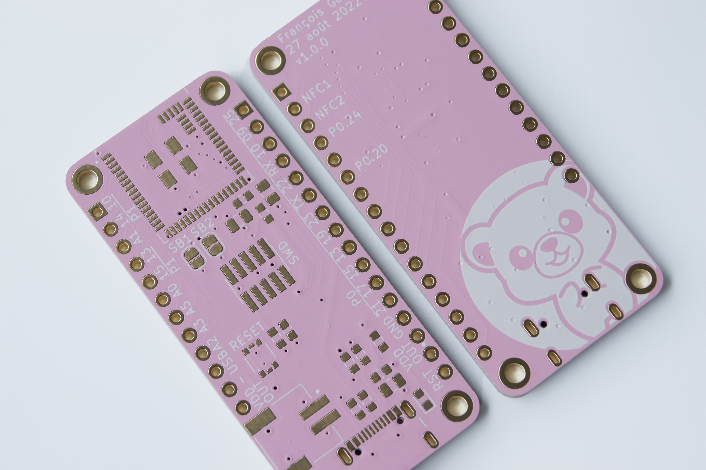

# MS88SF3 Breakout Board

## Objective

Try out the nRF52840 module from Minew.

## Power Consumption

### Sleep - Full RAM retention - GPIO wake-up

Average: 2.78 μA

## Price

## PCB

## BOM

### Firmware

